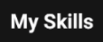
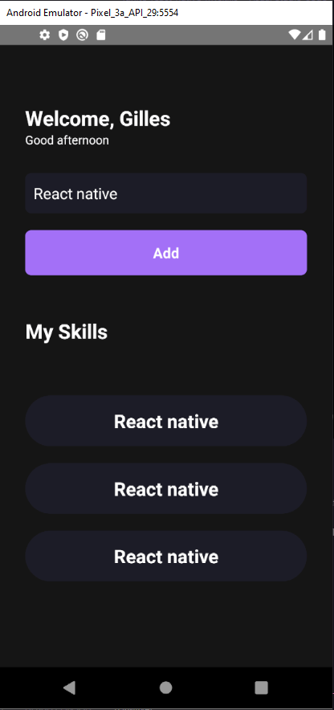

## My Skills Treinamento React Native Ignite

<h1 align="center">
  <p align="center">
    
  </p>

  <h3 align="center">
    Uma aplicação de um gerenciador de skills.  </h3>
  <p align="center">
     
      
      
      
  </p>
</h1>

<p align="center">
  <a href="#page_with_curl-sobre">Sobre</a>&nbsp;&nbsp;&nbsp;|&nbsp;&nbsp;&nbsp;
  <a href="#books-requisitos">Requisitos</a>&nbsp;&nbsp;&nbsp;|&nbsp;&nbsp;&nbsp;
  <a href="#rocket-começando">Começando</a>&nbsp;&nbsp;&nbsp;|&nbsp;&nbsp;&nbsp;
  <a href="#gear-iniciando-back-end">Node.js</a>&nbsp;&nbsp;&nbsp;|&nbsp;&nbsp;&nbsp;
</p>

## :page_with_curl: Sobre

My Skills é uma aplicação criada a partir do treinamento imersivo Ignite #1 para criar uma listagem de suas skills.

Nela o usuário tem acesso aos suas skills controlando o que pode aprender.

Nesse projeto tive como principal objetivo aprender conceitos basicos de useEffect, useState e imutabilidade.

## :books: Requisitos

- Ter [**Git**](https://git-scm.com/) para clonar o projeto.
- Ter [**Node.js**](https://nodejs.org/en/) instalado.
- Ter [**AndroidStudio**](https://developer.android.com/studio) instalado e com emulador rodando.
- Ter [**Yarn**](https://classic.yarnpkg.com/pt-BR/docs/install/) instalado.

## :rocket: 🎧🕹Começando

```bash
  # Clonar o projeto:
  $ git clone https://github.com/Gilles30/ignite-react-native-myskills.git

  # Entrar no diretório:
  $ cd ignite-react-native-myskills

  # Instalar as dependências:
  $ yarn

  # Rodar a aplicação:
  $ yarn android

```
:computer:

## Preview

<p size=3>
  
</p>

## 👨🏻‍🚀 Sobre mim

<a href="https://www.linkedin.com/in/lorison-gilles/">
 
 <p>Lorison Gilles</p>
</a>
<br>

Feito com 💜 por [Lorison Gilles](https://github.com/Gilles30) 🖖🏻👾☕